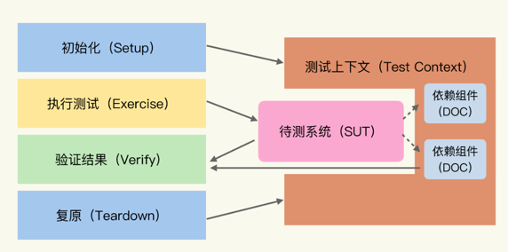

# TDD(Test-Driven Development) 特点

### 第一是，将要完成的功能分解成一系列任务，再将任务转化为测试，以测试体现研发进度，将整个开发过程变成有序的流程，以减少无效劳动。

### 第二是，在修改代码的时候，随时执行测试以验证功能，及时发现错误，降低发现、定位错误的成本，降低修改错误的难度。

### 第三是，时刻感受到认知的提升，增强自信降低恐惧。在针对列表参数使用任务分解法时，你明显可以感觉到，我们无论是对需求的把握性，还是对最终实现的可预见性，都有了大幅度的提升。甚至，如果更进一步要求，我们可以较有把握地评估（误差在 15% 以内）实现列表参数解析需要多长时间。这就是我们认知提升的具体体现。

## 这样的工作状态称为“职业程序工作状态”：有序、可控、自信。

## TDD编程方式

### 使用有意义的方法名代替注释

- || 不同的条件抽取到不同的方法

- && 条件通常抽取到同一个方法里


## 状态验证为什么是主要的使用方式?

### 测试的基本结构

无论使用什么样的测试框架，每个测试都由四个依次执行的阶段组成：初始化（SetUp）、执行测试（Exercise）、验证结果（Verify）和复原（Teardown）。如下图所示：


- **初始化。**主要是设置测试上下文，从而使待测系统（System Under Test）处于可测试的状态。例如，对于需要操作数据库的后台系统，测试上下文包含了已经灌注测试数据的测试用数据库，并将其与待测系统连接。

- **执行测试。**就是按照测试脚本的描述与待测系统互动。例如，按照功能描述，通过 API 对系统进行相应的操作。

- **验证结果。**就是验证待测系统是否处于我们期待的状态中。例如，经过测试，数据库中的业务数据是否发生了期待中的改变。

- **复原。**就是将测试上下文、待测系统复原回测试之前的状态，或者消除测试对于待测系统的副作用。例如，删除测试数据中的数据（通常是通过事务回滚）。

在测试的四个步骤中，验证结果是最核心的一步，也是最核心的技术。

验证结果有两种方式：**状态验证（State Verification）**和**行为验证（Behavior Verification）**。

### 状态验证
状态验证是指在与待测系统交互后，通过比对测试上下文与待测系统的状态变化，判断待测系统是否满足需求的验证方式。

状态验证是一种黑盒验证，它将测试上下文与待测系统当作一个整体。当待测系统不存在内部状态，而通过作用于依赖组件（Depended On Component）达成功能的时候，我们会从依赖组件中获取状态，以验证待测系统。如下图所示：



状态验证的一个难点是复原测试上下文，消除因执行测试造成的状态累积。如果待测系统是类库，一般问题不大，重新构造新的对象实例就行了。

而对于测试环境中存在进程外组件的情况，问题就要复杂一些了。在这种情况下，增量状态验证（Delta Verification）是一种有效的手段。

在每一个测试复原时，都使用了“drop-and-create”来清除数据库中的数据，从而消除状态累积。但如果因为种种原因（比如测试数据量很大），使得每次清除测试数据都变得不现实时，就可以使用增量状态验证来降低状态累积的影响。

### 行为验证(行为验证为什么应该尽量避免使用？)
行为验证是指通过待测系统与依赖组件（Depended On Component）的交互，来判断待测系统是否满足需求的验证方式。其验证方式如下图所示：


行为验证背后的逻辑是，状态的改变是由交互引起的。如果所有的交互都正确，那么就可以推断最终的状态也不会错。例如，对于如下的代码：

```java
interface Counter {
  void increase(); 
}

class SUT {
  public void action(Counter counter) {
    counter.increase();
  }
}
```

功能需求是 SUT 的 action 方法调用计数器 Counter 使其计数增加。按照状态验证，我们需要从 Counter 中获取内部计数，然后判断在执行测试前后，计数是否增加。

而对于行为验证，因为计数增加与否只在于是否调用了 increase 方法。那么如果 SUT 调用了 increase 方法，我们就可以推测Counter 的计数也必然增加了。于是，我们可以将对于读数增加的验证，转化为对于 increase 方法调用的验证：如果 increase 方法被调用了，那么我们可以推测SUT 是满足功能需求的。状态验果，行为推因。

对比状态验证和行为验证，在测试上下文中，引入了测试替身（Test Double）来作为测试上下文中的依赖组件，然后使用测试替身的验证方法代替了测试框架提供的断言方法。具体到项目例子中，使用 Mockito API 中的 verify 替换了 JUnit API 中的 assert 方法。

### 行为测试 VS 状态测试
行为验证在特定场景有用，但是会损失测试的有效性，TDD还是以状态验证为主，在容器时代mock会变得容易很多。

## 集成测试还是单元测试？


如上图所示，第一个测试的测试范围包含了 Args 和 OptionParser，可以看作是“集成测试”或“功能测试”。第二个测试的测试范围仅仅覆盖 OptionParser，才会被看作是“单元测试”。

这个 OptionParser 接口并不是一开始就存在，而是通过重构获得的。在重构的过程中，我们从 Args 中分离了部分代码，从而使得 ArgsTest 的测试范围不再聚焦于某一个单元，而是覆盖了更多的单元。

于是 ArgsTest 就成了“集成测试”。更有意思的是，在重构的过程中，虽然这个测试没有任何变动，但是到重构结束的时候，它就从“单元测试”变成了“集成测试”。

### TDD 中的单元测试
在 TDD 的语境下，“单元测试”指的是能提供快速反馈的低成本的研发测试（Developer Test）。TDD 社区希望通过强调“单元测试”，来强调这些特点。但是“单元测试”这个词，并不是由 TDD 社区发明的，而是软件行业中由来已久的一个词汇。在不做任何强调的情况下，它会指针对不涉及进程外组件的单一软件单元的测试。

- TDD 中的测试是由不同粒度的功能测试构成的；

- 每一个测试都兼具功能验证和错误定位的功效；

- 要从发现问题和定位问题的角度，去思考测试的效用与成本；

- 单元粒度要以独立的功能上下文或变化点为粒度。

### TDD应该作为分解功能进行代码开发，而非测试方法，所以TDD关注点不该在单元测试这种专业的测试术语上，而是不同粒度的功能测试。

## 驱动的极限是什么？

从“驱动”的角度来说，TDD 实际上并不是一种编码技术（Coding Technique），它无法帮助实现你不会写的代码，你必须要知道如何实现这些功能；但是一旦你明确了要实现的功能，并且知道要怎么实现，TDD 可以帮助你更好地将功能放置到不同的单元。也就是说，TDD“驱动”的是架构，因而实际是一种架构技术。

是的，这正是我们讲的编码架构师（Coding Architect），也是真正的实干型而非 PPT 型架构师。这也是为什么 TDD 也被看作 Test Driven Design。

### 重构的手法
四种常用的重构手法，分别是提取方法、内联方法、引入参数和引入字段。并区分了用于高效修改代码的重构手法，和用于消除坏味道以改进架构设计的重构。还介绍了一种架构软件的方法：重构到模式。也就是通过重构将坏味道替换为模式，从而改进软件架构的方式。

## TDD中的经典学派(Classic School)与伦敦学派(London School)
重构到模式，或者说 TDD 红 / 绿 / 重构循环中的重构，是在完成功能的前提下以演进的方式进行设计。这是延迟性决策策略，也叫最晚尽责时刻（Last Responsible Moment，LRM）。也就是说，与其在信息不足的情况下做决定，不如延迟到信息更多，或是不得不做出决策的时机再决策。这种策略的重点在于，在保持决策有效性的前提下，尽可能地推迟决策时间。

如果架构愿景不清晰，那么“最晚尽责时刻”让我们不必花费时间进行空对空的讨论，可以尽早开始实现功能，再通过重构从可工作的软件（Working Software）中提取架构。这种方式也被称作 TDD 的经典学派（Classic School）或芝加哥学派（Chicago School）。

除了经典学派之外，还有一种 TDD 风格，被称作 TDD 的伦敦学派（London School）。如果架构愿景已经比较清晰了，那么我们就可以使用伦敦学派进行 TDD。

### 伦敦学派的做法
- 按照功能需求与架构愿景划分对象的角色和职责；

- 根据角色与职责，明确对象之间的交互；

- 按照调用栈（Call Stack）的顺序，自外向内依次实现不同的对象；

- 在实现的过程中，依照交互关系，使用测试替身替换所有与被实现对象直接关联的对象；

- 直到所有对象全部都实现完成。

### 经典学派做法
- 经典学派强调功能优先，设计 / 架构后置，通过重构进行演进式设计。

- 而“伦敦学派”并不排斥预先存在的设计，更强调如何通过测试替身，将注意力集中到功能上下文中的某个对象上。然后在测试的驱动下，按部就班地完成功能开发。

可以将伦敦学派看作一种利用架构愿景分割功能上下文，然后再进入经典模式的 TDD 方法。这么做的好处是，对于复杂的场景，可以极大简化构造测试的时间。

经典学派和伦敦学派是 TDD 中都需要掌握的基本功。在功能上下文内，以经典学派为主；而跨功能上下文时，可以使用伦敦学派对不同的功能上下文进行隔离。

- 经典学派质疑伦敦学派向预先设计妥协，放弃了演进式架构。

- 伦敦学派攻击经典学派不愿吸收借鉴行业积累，“难道每次都要从一个大类重构到 MVC 吗？”

然而这种分歧是无意义的。在不同的场合下，我们只需要使用该用的方式就好。

### 测试驱动到底能够驱动什么？
单元级别功能测试能够驱动其对应单元（功能上下文或变化点）的功能需求。而对于单元之内某个功能的实现，则无能为力。

从“驱动”的角度来说，TDD 实际上并不是一种编码技术，更像是一种架构技术，它可以帮助你更好地将功能放置到不同的单元。于是我们继续介绍了 TDD 中两种处理架构的思路：延迟性决策的经典学派和通过架构愿景划分功能上下文的伦敦学派。
